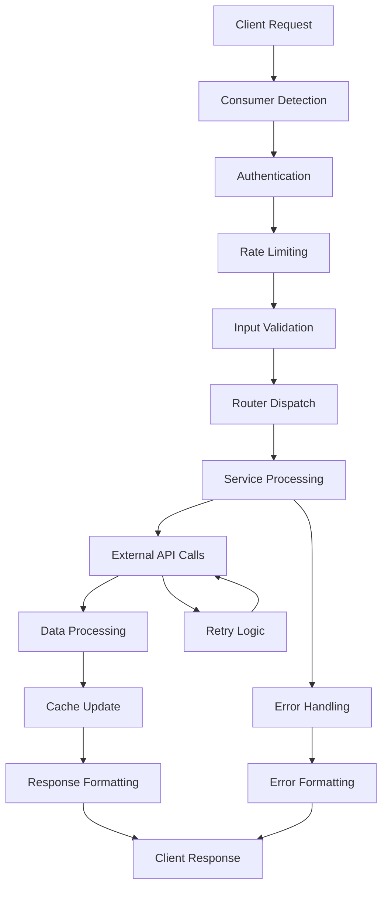

# TripSage API Architecture

This document provides a detailed architectural overview of the TripSage Unified API, a FastAPI-based system that serves both frontend applications and AI agents for travel planning.

## Table of Contents

- [Architectural Overview](#architectural-overview)
- [Dual Consumer Architecture](#dual-consumer-architecture)
- [Layer Architecture](#layer-architecture)
- [Request Processing Architecture](#request-processing-architecture)
- [Authentication Architecture](#authentication-architecture)
- [Service Integration Architecture](#service-integration-architecture)
- [Real-time Communication Architecture](#real-time-communication-architecture)
- [Performance Architecture](#performance-architecture)
- [Security Architecture](#security-architecture)
- [Deployment Architecture](#deployment-architecture)

## Architectural Overview

The TripSage API implements a unified architecture that serves multiple consumer types while maintaining clean separation of concerns and high performance.

### Core Design Principles

1. **Unified Interface** - Single API serving multiple consumer types
2. **Consumer Awareness** - Automatic adaptation based on client requirements
3. **Service Oriented** - Clean service boundaries with dependency injection
4. **Event Driven** - Real-time updates through WebSocket communication
5. **Performance First** - Optimized caching and database strategies
6. **Security by Design** - Multi-layer security with encryption and monitoring

### High-Level Architecture

```
┌─────────────────────────────────────────────────────────────────┐
│                     TripSage API Layer                         │
├─────────────────────────────────────────────────────────────────┤
│  ┌─────────────┐  ┌─────────────┐  ┌─────────────────────────┐  │
│  │  Frontend   │  │  AI Agents  │  │   External Services     │  │
│  │  (Next.js)  │  │ (LangGraph) │  │ (Travel Platforms)      │  │
│  └─────────────┘  └─────────────┘  └─────────────────────────┘  │
├─────────────────────────────────────────────────────────────────┤
│                    API Gateway Layer                           │
│  ┌─────────────────────────────────────────────────────────┐    │
│  │     Consumer Detection & Routing                       │    │
│  │  ┌─────────────┐  ┌─────────────┐  ┌─────────────┐    │    │
│  │  │ Frontend    │  │   Agent     │  │   Admin     │    │    │
│  │  │ Adapter     │  │  Adapter    │  │  Adapter    │    │    │
│  │  └─────────────┘  └─────────────┘  └─────────────┘    │    │
│  └─────────────────────────────────────────────────────────┘    │
├─────────────────────────────────────────────────────────────────┤
│                    Middleware Stack                            │
│  ┌─────────────────────────────────────────────────────────┐    │
│  │  Authentication → Rate Limiting → Logging → CORS       │    │
│  └─────────────────────────────────────────────────────────┘    │
├─────────────────────────────────────────────────────────────────┤
│                     Router Layer                               │
│  ┌─────┐ ┌─────┐ ┌─────┐ ┌─────┐ ┌─────┐ ┌─────┐ ┌─────┐      │
│  │Auth │ │Trip │ │Chat │ │Flt  │ │Hotel│ │Dest │ │WebS │      │
│  └─────┘ └─────┘ └─────┘ └─────┘ └─────┘ └─────┘ └─────┘      │
├─────────────────────────────────────────────────────────────────┤
│                    Service Layer                               │
│  ┌─────────────────────────────────────────────────────────┐    │
│  │              TripSage Core Services                     │    │
│  │  ┌─────────────┐  ┌─────────────┐  ┌─────────────┐    │    │
│  │  │  Business   │  │ External    │  │Infrastructure│    │    │
│  │  │  Services   │  │ APIs        │  │  Services    │    │    │
│  │  └─────────────┘  └─────────────┘  └─────────────┘    │    │
│  └─────────────────────────────────────────────────────────┘    │
├─────────────────────────────────────────────────────────────────┤
│                 Infrastructure Layer                           │
│  ┌─────────────┐  ┌─────────────┐  ┌─────────────────────┐      │
│  │  Supabase   │  │ DragonflyDB │  │  External APIs      │      │
│  │ (Database)  │  │  (Cache)    │  │ (Flights, Hotels)   │      │
│  └─────────────┘  └─────────────┘  └─────────────────────┘      │
└─────────────────────────────────────────────────────────────────┘
```

## Dual Consumer Architecture

### Consumer Detection and Adaptation

The API automatically detects consumer type and adapts responses accordingly:

```python
class ConsumerDetector:
    @staticmethod
    def detect_consumer_type(request: Request) -> ConsumerType:
        # Check User-Agent patterns
        user_agent = request.headers.get("user-agent", "").lower()
        
        if "agent" in user_agent or "langgraph" in user_agent:
            return ConsumerType.AGENT
        elif "next.js" in user_agent or "browser" in user_agent:
            return ConsumerType.FRONTEND
        
        # Check API key patterns
        api_key = request.headers.get("x-api-key")
        if api_key and api_key.startswith("agent_"):
            return ConsumerType.AGENT
        
        # Check JWT token claims
        auth_header = request.headers.get("authorization")
        if auth_header:
            token_claims = decode_jwt_token(auth_header)
            return token_claims.get("consumer_type", ConsumerType.FRONTEND)
        
        return ConsumerType.FRONTEND
```

### Consumer-Specific Response Formatting

#### Frontend Response Format
```python
class FrontendResponseFormatter:
    @staticmethod
    def format_response(data: Any, request_context: RequestContext) -> dict:
        return {
            "data": data,
            "meta": {
                "ui_hints": {
                    "loading_complete": True,
                    "suggested_actions": ["save", "share", "book"],
                    "display_priority": "high"
                },
                "pagination": {
                    "page": request_context.page,
                    "total_pages": request_context.total_pages,
                    "has_next": request_context.has_next
                },
                "user_context": {
                    "preferences_applied": True,
                    "budget_constraints": request_context.budget_info
                }
            }
        }
    
    @staticmethod
    def format_error(error: Exception) -> dict:
        return {
            "error": {
                "type": "user_error",
                "message": get_user_friendly_message(error),
                "field": getattr(error, "field", None),
                "suggestion": get_user_suggestion(error),
                "recovery_actions": ["retry", "modify_search", "contact_support"]
            }
        }
```

#### Agent Response Format
```python
class AgentResponseFormatter:
    @staticmethod
    def format_response(data: Any, request_context: RequestContext) -> dict:
        return {
            "data": data,
            "agent_context": {
                "reasoning_data": {
                    "confidence_score": request_context.confidence,
                    "data_freshness": request_context.cache_age,
                    "alternative_options": request_context.alternatives
                },
                "tool_suggestions": [
                    "search_alternatives",
                    "check_price_history",
                    "analyze_reviews"
                ],
                "next_actions": [
                    "present_options",
                    "await_user_choice",
                    "refine_search"
                ],
                "conversation_context": request_context.memory_context
            },
            "performance_metrics": {
                "processing_time_ms": request_context.processing_time,
                "cache_hit_ratio": request_context.cache_stats,
                "api_calls_made": request_context.external_calls
            }
        }
    
    @staticmethod
    def format_error(error: Exception) -> dict:
        return {
            "error": {
                "type": type(error).__name__,
                "message": str(error),
                "technical_details": {
                    "service": getattr(error, "service", None),
                    "status_code": getattr(error, "status_code", None),
                    "retry_after": getattr(error, "retry_after", None),
                    "fallback_available": has_fallback_service(error)
                },
                "debugging_context": {
                    "request_id": request_context.request_id,
                    "stack_trace": format_stack_trace(error),
                    "related_logs": get_related_log_entries(error)
                }
            }
        }
```

## Layer Architecture

### Router Layer

Domain-specific routers with clean separation:

```python
# Router organization pattern
class RouterConfig:
    ROUTERS = [
        # Core functionality
        ("auth", "/auth", "Authentication and authorization"),
        ("keys", "/keys", "API key management"),
        ("health", "/health", "Health checks and monitoring"),
        
        # Travel planning
        ("trips", "/trips", "Trip planning and management"),
        ("itineraries", "/itineraries", "Itinerary building and optimization"),
        
        # Search and booking
        ("flights", "/flights", "Flight search and booking"),
        ("accommodations", "/accommodations", "Hotel and lodging search"),
        ("destinations", "/destinations", "Destination research"),
        
        # AI and communication
        ("chat", "/chat", "Chat and conversation"),
        ("memory", "/memory", "Memory and context management"),
        ("websocket", "/ws", "Real-time communication"),
        
        # File processing
        ("attachments", "/attachments", "File upload and processing")
    ]
```

### Middleware Stack

Ordered middleware processing with consumer awareness:

```python
class MiddlewareStack:
    MIDDLEWARE_ORDER = [
        CORSMiddleware,          # Cross-origin resource sharing
        ConsumerDetectionMiddleware,  # Detect consumer type
        AuthenticationMiddleware,     # JWT/API key validation
        RateLimitingMiddleware,      # Consumer-aware rate limiting
        RequestLoggingMiddleware,    # Structured logging
        ErrorHandlingMiddleware,     # Exception processing
        ResponseFormattingMiddleware # Consumer-specific formatting
    ]
    
    @classmethod
    def configure_middleware(cls, app: FastAPI):
        for middleware_class in reversed(cls.MIDDLEWARE_ORDER):
            app.add_middleware(middleware_class)
```

### Service Layer Integration

Clean service injection with TripSage Core:

```python
class ServiceFactory:
    def __init__(self, settings: BaseAppSettings):
        self.settings = settings
        self._service_cache = {}
    
    def get_service(self, service_type: Type[T]) -> T:
        """Get service instance with caching"""
        if service_type not in self._service_cache:
            self._service_cache[service_type] = service_type(self.settings)
        return self._service_cache[service_type]
    
    # Service getters
    def get_auth_service(self) -> AuthService:
        return self.get_service(AuthService)
    
    def get_flight_service(self) -> FlightService:
        return self.get_service(FlightService)
    
    def get_memory_service(self) -> MemoryService:
        return self.get_service(MemoryService)
```

## Request Processing Architecture

### Request Flow Pipeline



### Request Context Management

```python
class RequestContext:
    """Comprehensive request context for processing pipeline"""
    
    def __init__(self, request: Request):
        self.request_id = generate_request_id()
        self.consumer_type = ConsumerDetector.detect_consumer_type(request)
        self.user_id = None
        self.session_id = None
        self.start_time = time.time()
        
        # Processing metadata
        self.cache_stats = CacheStats()
        self.external_calls = []
        self.performance_metrics = PerformanceMetrics()
        
        # Consumer-specific context
        self.ui_preferences = None
        self.agent_context = None
        
    async def initialize_user_context(self, user: User):
        """Initialize user-specific context"""
        self.user_id = user.id
        
        if self.consumer_type == ConsumerType.FRONTEND:
            self.ui_preferences = await self.load_ui_preferences(user.id)
        elif self.consumer_type == ConsumerType.AGENT:
            self.agent_context = await self.load_agent_context(user.id)
    
    def add_external_call(self, service: str, endpoint: str, duration: float):
        """Track external API calls for monitoring"""
        self.external_calls.append({
            "service": service,
            "endpoint": endpoint,
            "duration_ms": duration * 1000,
            "timestamp": time.time()
        })
    
    @property
    def processing_time(self) -> float:
        """Total processing time in milliseconds"""
        return (time.time() - self.start_time) * 1000
```

### Error Processing Pipeline

```python
class ErrorProcessor:
    @staticmethod
    async def process_error(
        error: Exception,
        context: RequestContext
    ) -> ErrorResponse:
        # Log error with context
        logger.error(
            "Request processing error",
            extra={
                "request_id": context.request_id,
                "consumer_type": context.consumer_type,
                "error_type": type(error).__name__,
                "user_id": context.user_id,
                "processing_time": context.processing_time
            }
        )
        
        # Format error based on consumer type
        if context.consumer_type == ConsumerType.FRONTEND:
            return FrontendResponseFormatter.format_error(error)
        else:
            return AgentResponseFormatter.format_error(error)
```

## Authentication Architecture

### Multi-Modal Authentication System

```python
class AuthenticationSystem:
    """Unified authentication supporting multiple methods"""
    
    def __init__(self, settings: BaseAppSettings):
        self.jwt_handler = JWTHandler(settings)
        self.api_key_handler = APIKeyHandler(settings)
        self.byok_handler = BYOKHandler(settings)
    
    async def authenticate_request(self, request: Request) -> AuthResult:
        # Try JWT authentication first
        auth_header = request.headers.get("authorization")
        if auth_header and auth_header.startswith("Bearer "):
            return await self.jwt_handler.verify_token(auth_header)
        
        # Try API key authentication
        api_key = request.headers.get("x-api-key")
        if api_key:
            return await self.api_key_handler.verify_key(api_key)
        
        # Check for BYOK in request body (for key management endpoints)
        if request.url.path.startswith("/api/v1/keys"):
            return await self.byok_handler.verify_request(request)
        
        raise AuthenticationError("No valid authentication provided")
```

### JWT Token Architecture

```python
class JWTTokenSystem:
    """JWT token management with refresh capability"""
    
    TOKEN_TYPES = {
        "access": {"exp": 30 * 60, "refresh": False},      # 30 minutes
        "refresh": {"exp": 7 * 24 * 60 * 60, "refresh": True},  # 7 days
    }
    
    async def create_token_pair(self, user: User) -> TokenPair:
        """Create access and refresh token pair"""
        access_token = self.create_token(
            user_id=user.id,
            token_type="access",
            consumer_type=user.preferred_consumer_type
        )
        
        refresh_token = self.create_token(
            user_id=user.id,
            token_type="refresh",
            consumer_type=user.preferred_consumer_type
        )
        
        return TokenPair(
            access_token=access_token,
            refresh_token=refresh_token,
            expires_in=self.TOKEN_TYPES["access"]["exp"]
        )
    
    async def refresh_token_pair(self, refresh_token: str) -> TokenPair:
        """Refresh token pair using refresh token"""
        payload = self.verify_token(refresh_token)
        
        if payload.get("token_type") != "refresh":
            raise AuthenticationError("Invalid refresh token")
        
        user = await self.get_user(payload["user_id"])
        return await self.create_token_pair(user)
```

### BYOK (Bring Your Own Key) Architecture

```python
class BYOKSystem:
    """Secure user-provided API key management"""
    
    SUPPORTED_SERVICES = {
        "duffel": {"validator": DuffelKeyValidator, "encryption": True},
        "google_maps": {"validator": GoogleMapsValidator, "encryption": True},
        "openweather": {"validator": WeatherValidator, "encryption": True}
    }
    
    async def store_user_key(
        self,
        user_id: str,
        service: str,
        api_key: str,
        description: str = None
    ) -> UserAPIKey:
        """Store encrypted user API key"""
        # Validate service is supported
        if service not in self.SUPPORTED_SERVICES:
            raise ValidationError(f"Service {service} not supported")
        
        # Validate API key with service
        validator = self.SUPPORTED_SERVICES[service]["validator"]
        is_valid = await validator.validate_key(api_key)
        if not is_valid:
            raise ValidationError(f"Invalid {service} API key")
        
        # Generate user-specific salt
        user_salt = self.generate_user_salt(user_id)
        
        # Encrypt API key
        encrypted_key = self.encrypt_api_key(api_key, user_salt)
        
        # Store in database
        user_key = UserAPIKey(
            user_id=user_id,
            service=service,
            encrypted_key=encrypted_key,
            description=description,
            is_active=True,
            created_at=datetime.utcnow()
        )
        
        return await self.db.create(user_key)
    
    async def get_user_key(self, user_id: str, service: str) -> str:
        """Retrieve and decrypt user API key"""
        user_key = await self.db.query(UserAPIKey).filter(
            UserAPIKey.user_id == user_id,
            UserAPIKey.service == service,
            UserAPIKey.is_active == True
        ).first()
        
        if not user_key:
            return None
        
        user_salt = self.generate_user_salt(user_id)
        return self.decrypt_api_key(user_key.encrypted_key, user_salt)
```

## Service Integration Architecture

### Service Orchestration Pattern

```python
class ServiceOrchestrator:
    """Coordinate multiple services for complex operations"""
    
    def __init__(self, service_factory: ServiceFactory):
        self.services = service_factory
    
    async def search_complete_trip(
        self,
        criteria: TripSearchCriteria,
        context: RequestContext
    ) -> CompleteSearchResults:
        """Orchestrate complete trip search across multiple services"""
        
        # Parallel service calls
        tasks = []
        
        # Flight search
        if criteria.include_flights:
            tasks.append(
                self.services.get_flight_service().search_flights(
                    criteria.flight_criteria
                )
            )
        
        # Accommodation search
        if criteria.include_accommodations:
            tasks.append(
                self.services.get_accommodation_service().search_accommodations(
                    criteria.accommodation_criteria
                )
            )
        
        # Destination research
        if criteria.include_destination_info:
            tasks.append(
                self.services.get_destination_service().get_destination_insights(
                    criteria.destination
                )
            )
        
        # Execute all searches concurrently
        results = await asyncio.gather(*tasks, return_exceptions=True)
        
        # Process results and handle any errors
        processed_results = self.process_search_results(results, criteria)
        
        # Store search in memory for future reference
        await self.services.get_memory_service().store_search_memory(
            user_id=context.user_id,
            search_criteria=criteria,
            results=processed_results
        )
        
        return processed_results
```

### External API Integration Pattern

```python
class ExternalAPIIntegrator:
    """Standardized external API integration with fallbacks"""
    
    def __init__(self, settings: BaseAppSettings):
        self.settings = settings
        self.rate_limiters = {}
        self.circuit_breakers = {}
    
    async def call_external_service(
        self,
        service_name: str,
        operation: str,
        user_id: str = None,
        **kwargs
    ) -> Any:
        """Make external API call with user key fallback"""
        
        # Try user's API key first if available
        if user_id:
            user_key = await self.get_user_api_key(user_id, service_name)
            if user_key:
                try:
                    return await self._make_api_call(
                        service_name, operation, user_key, **kwargs
                    )
                except Exception as e:
                    logger.warning(f"User key failed for {service_name}: {e}")
        
        # Fallback to system API key
        system_key = self.settings.get_system_api_key(service_name)
        if not system_key:
            raise ExternalAPIError(f"No API key available for {service_name}")
        
        return await self._make_api_call(
            service_name, operation, system_key, **kwargs
        )
    
    async def _make_api_call(
        self,
        service: str,
        operation: str,
        api_key: str,
        **kwargs
    ) -> Any:
        """Make actual API call with rate limiting and circuit breaker"""
        
        # Check rate limits
        await self.check_rate_limit(service, api_key)
        
        # Check circuit breaker
        if self.circuit_breakers.get(service, {}).get("open", False):
            raise ExternalAPIError(f"Circuit breaker open for {service}")
        
        try:
            # Make the API call
            response = await self._execute_api_call(service, operation, api_key, **kwargs)
            
            # Reset circuit breaker on success
            self.reset_circuit_breaker(service)
            
            return response
            
        except Exception as e:
            # Update circuit breaker on failure
            self.update_circuit_breaker(service, e)
            raise
```

## Real-time Communication Architecture

### WebSocket Management System

```python
class WebSocketArchitecture:
    """Comprehensive WebSocket management for real-time features"""
    
    def __init__(self):
        self.connection_manager = ConnectionManager()
        self.message_router = MessageRouter()
        self.event_broadcaster = EventBroadcaster()
    
    async def handle_websocket_connection(
        self,
        websocket: WebSocket,
        user_id: str,
        session_type: str
    ):
        """Handle new WebSocket connection"""
        await self.connection_manager.connect(
            websocket, user_id, session_type
        )
        
        try:
            while True:
                # Receive message from client
                message = await websocket.receive_json()
                
                # Route message to appropriate handler
                response = await self.message_router.route_message(
                    message, user_id, session_type
                )
                
                # Send response back to client
                if response:
                    await websocket.send_json(response)
                    
        except WebSocketDisconnect:
            await self.connection_manager.disconnect(websocket, user_id)
```

### Real-time Event System

```python
class RealtimeEventSystem:
    """Event-driven real-time updates"""
    
    EVENT_TYPES = {
        "trip.created": "Trip planning started",
        "flight.price_change": "Flight price updated",
        "booking.confirmed": "Booking confirmed",
        "agent.status_update": "Agent processing update",
        "chat.message": "New chat message",
        "memory.updated": "Context updated"
    }
    
    async def broadcast_event(
        self,
        event_type: str,
        data: dict,
        target_users: List[str] = None,
        target_sessions: List[str] = None
    ):
        """Broadcast event to targeted recipients"""
        event = RealtimeEvent(
            type=event_type,
            data=data,
            timestamp=time.time(),
            target_users=target_users,
            target_sessions=target_sessions
        )
        
        await self.event_broadcaster.broadcast(event)
    
    async def handle_trip_update(self, trip_id: str, update_data: dict):
        """Handle trip update and broadcast to interested parties"""
        # Get users interested in this trip
        interested_users = await self.get_trip_collaborators(trip_id)
        
        # Broadcast update
        await self.broadcast_event(
            "trip.updated",
            {
                "trip_id": trip_id,
                "updates": update_data,
                "updated_by": update_data.get("user_id")
            },
            target_users=interested_users
        )
```

## Performance Architecture

### Caching Strategy Architecture

```python
class CacheArchitecture:
    """Multi-tier caching with intelligent TTL management"""
    
    CACHE_TIERS = {
        "hot": {
            "ttl": 300,      # 5 minutes
            "use_cases": ["flight_prices", "availability", "user_sessions"],
            "storage": "memory"
        },
        "warm": {
            "ttl": 3600,     # 1 hour
            "use_cases": ["search_results", "destination_info", "weather"],
            "storage": "dragonfly"
        },
        "cold": {
            "ttl": 86400,    # 24 hours
            "use_cases": ["static_data", "user_preferences", "historical_data"],
            "storage": "dragonfly"
        }
    }
    
    async def get_cached_data(
        self,
        key: str,
        data_type: str,
        factory: Callable = None
    ) -> Any:
        """Intelligent cache retrieval with tier management"""
        tier_config = self.get_tier_for_data_type(data_type)
        
        # Try cache first
        cached_data = await self.cache_client.get(key)
        if cached_data:
            return cached_data
        
        # Generate data if factory provided
        if factory:
            data = await factory()
            await self.cache_client.set(
                key, data, ttl=tier_config["ttl"]
            )
            return data
        
        return None
```

### Database Performance Architecture

```python
class DatabasePerformanceArchitecture:
    """Optimized database operations with connection pooling"""
    
    CONNECTION_POOL_CONFIG = {
        "min_size": 5,
        "max_size": 20,
        "max_queries": 50000,
        "max_inactive_connection_lifetime": 300,
        "timeout": 60
    }
    
    QUERY_OPTIMIZATION = {
        "slow_query_threshold": 1.0,  # seconds
        "enable_query_planning": True,
        "use_prepared_statements": True,
        "batch_size": 1000
    }
    
    async def execute_optimized_query(
        self,
        query: str,
        params: dict = None,
        use_cache: bool = True
    ) -> Any:
        """Execute query with performance optimizations"""
        
        # Generate cache key for query
        if use_cache:
            cache_key = self.generate_query_cache_key(query, params)
            cached_result = await self.get_cached_query_result(cache_key)
            if cached_result:
                return cached_result
        
        # Execute query with timing
        start_time = time.time()
        result = await self.execute_query(query, params)
        execution_time = time.time() - start_time
        
        # Log slow queries
        if execution_time > self.QUERY_OPTIMIZATION["slow_query_threshold"]:
            logger.warning(
                "Slow query detected",
                extra={
                    "query": query,
                    "execution_time": execution_time,
                    "params": params
                }
            )
        
        # Cache result if applicable
        if use_cache and execution_time > 0.1:  # Cache queries > 100ms
            await self.cache_query_result(cache_key, result)
        
        return result
```

## Security Architecture

### Multi-Layer Security Model

```python
class SecurityArchitecture:
    """Comprehensive security implementation"""
    
    SECURITY_LAYERS = [
        "network_security",     # HTTPS, firewall rules
        "authentication",       # JWT, API keys, BYOK
        "authorization",        # Role-based access control
        "input_validation",     # Request sanitization
        "rate_limiting",        # Abuse prevention
        "encryption",          # Data protection
        "monitoring",          # Security event tracking
        "audit_logging"        # Compliance and forensics
    ]
    
    async def secure_request_pipeline(
        self,
        request: Request,
        endpoint_config: EndpointConfig
    ) -> SecurityContext:
        """Execute complete security pipeline"""
        
        security_context = SecurityContext()
        
        # 1. Authentication
        auth_result = await self.authenticate_request(request)
        security_context.user = auth_result.user
        security_context.principal = auth_result.principal
        
        # 2. Authorization
        await self.authorize_request(
            auth_result.user, 
            endpoint_config.required_permissions
        )
        
        # 3. Input validation
        await self.validate_request_input(request, endpoint_config.schema)
        
        # 4. Rate limiting
        await self.check_rate_limits(
            auth_result.principal,
            endpoint_config.rate_limits
        )
        
        # 5. Security monitoring
        await self.log_security_event(request, auth_result, "access_granted")
        
        return security_context
```

### Data Protection Architecture

```python
class DataProtectionSystem:
    """Data encryption and protection implementation"""
    
    ENCRYPTION_CONFIG = {
        "algorithm": "AES-256-GCM",
        "key_rotation_days": 90,
        "backup_key_count": 3
    }
    
    PII_FIELDS = [
        "email", "phone", "passport_number",
        "credit_card", "api_key", "password"
    ]
    
    async def encrypt_sensitive_data(self, data: dict) -> dict:
        """Encrypt PII and sensitive data"""
        encrypted_data = data.copy()
        
        for field in self.PII_FIELDS:
            if field in encrypted_data:
                encrypted_data[field] = self.encrypt_field(
                    encrypted_data[field]
                )
        
        return encrypted_data
    
    async def audit_data_access(
        self,
        user_id: str,
        data_type: str,
        operation: str,
        data_identifiers: List[str]
    ):
        """Log data access for compliance"""
        audit_entry = DataAccessAudit(
            user_id=user_id,
            data_type=data_type,
            operation=operation,
            data_identifiers=data_identifiers,
            timestamp=datetime.utcnow(),
            ip_address=self.get_request_ip(),
            user_agent=self.get_request_user_agent()
        )
        
        await self.audit_logger.log(audit_entry)
```

## Deployment Architecture

### Containerized Deployment

```python
class DeploymentArchitecture:
    """Production deployment configuration"""
    
    DEPLOYMENT_TIERS = {
        "development": {
            "replicas": 1,
            "resources": {"cpu": "0.5", "memory": "1Gi"},
            "auto_scaling": False
        },
        "staging": {
            "replicas": 2,
            "resources": {"cpu": "1", "memory": "2Gi"},
            "auto_scaling": True,
            "min_replicas": 2,
            "max_replicas": 5
        },
        "production": {
            "replicas": 3,
            "resources": {"cpu": "2", "memory": "4Gi"},
            "auto_scaling": True,
            "min_replicas": 3,
            "max_replicas": 20
        }
    }
    
    HEALTH_CHECK_CONFIG = {
        "startup_probe": {
            "path": "/api/health",
            "initial_delay": 30,
            "period": 10
        },
        "liveness_probe": {
            "path": "/api/health",
            "period": 30,
            "timeout": 5
        },
        "readiness_probe": {
            "path": "/api/health/ready",
            "period": 10,
            "timeout": 3
        }
    }
```

### Monitoring and Observability

```python
class ObservabilityArchitecture:
    """Comprehensive monitoring and observability"""
    
    METRICS_CONFIG = {
        "request_duration": {
            "type": "histogram",
            "buckets": [0.1, 0.5, 1.0, 2.5, 5.0, 10.0]
        },
        "request_count": {
            "type": "counter",
            "labels": ["method", "endpoint", "status_code", "consumer_type"]
        },
        "error_rate": {
            "type": "gauge",
            "labels": ["service", "error_type"]
        },
        "cache_hit_ratio": {
            "type": "gauge",
            "labels": ["cache_tier", "data_type"]
        }
    }
    
    async def record_request_metrics(
        self,
        request: Request,
        response: Response,
        processing_time: float,
        context: RequestContext
    ):
        """Record comprehensive request metrics"""
        
        # Request duration
        self.metrics.record_histogram(
            "request_duration",
            processing_time,
            labels={
                "method": request.method,
                "endpoint": self.normalize_endpoint(request.url.path),
                "consumer_type": context.consumer_type
            }
        )
        
        # Request count
        self.metrics.increment_counter(
            "request_count",
            labels={
                "method": request.method,
                "endpoint": self.normalize_endpoint(request.url.path),
                "status_code": response.status_code,
                "consumer_type": context.consumer_type
            }
        )
        
        # Cache metrics
        if context.cache_stats:
            self.metrics.set_gauge(
                "cache_hit_ratio",
                context.cache_stats.hit_ratio,
                labels={
                    "cache_tier": context.cache_stats.tier,
                    "data_type": context.cache_stats.data_type
                }
            )
```

This architecture provides a robust, scalable, and secure foundation for the TripSage API, enabling it to serve both frontend applications and AI agents efficiently while maintaining high performance and security standards.