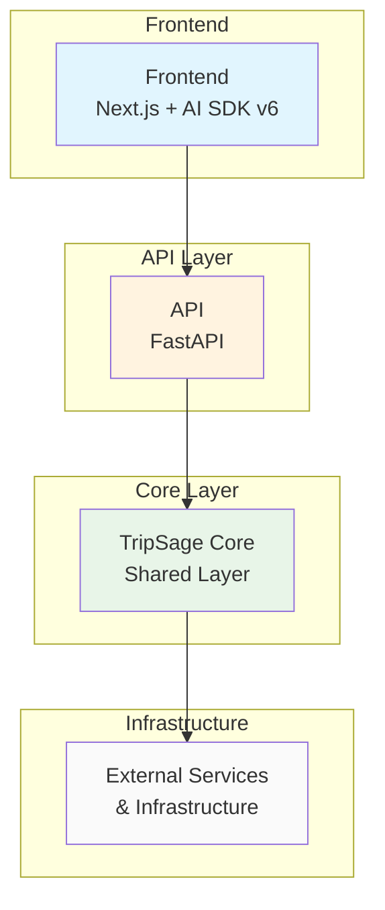

# TripSage API

A FastAPI implementation that serves both frontend applications and AI agents for the TripSage travel planning platform.

## Overview

The TripSage API provides endpoints for:

- **Frontend Applications** - Next.js 15 web application with real-time features and AI SDK v6 agents
- **External Integrations** - Third-party services and travel platforms
**Real-time Communication** - Supabase Realtime private channels with RLS authorization (no custom WebSocket endpoints).

### Core Capabilities

- **Trip Planning & Management** - Travel planning workflow
- **Flight Search & Booking** - Multi-provider flight search and comparison
- **Accommodation Search** - Hotel and alternative lodging search
- **Destination Research** - AI-powered destination insights and recommendations
- **Itinerary Building** - Trip optimization and scheduling
- **Memory & Context** - Conversation memory and user preference learning
**Real-time Communication** - Supabase Realtime (no custom WebSocket endpoints)

## Architecture

The API implements a dual-consumer architecture serving both frontend and agent clients:



### Frontend Integration

The API serves the Next.js frontend which includes AI SDK v6 agents:

- **User-friendly error messages** - Simplified, actionable error descriptions
- **Response metadata** - UI state information and display hints
- **Rate limiting** - Standard user-based limits
- **Sanitized data** - Secure, filtered data appropriate for frontend display
- **AI Agent Support** - Frontend uses AI SDK v6 with TypeScript tools for chat and travel planning

## Directory Structure

```text
tripsage/api/
├── core/                    # Core configuration and framework
│   ├── config.py           # Application settings and environment config
│   ├── dependencies.py     # Dependency injection and service factories
│   └── openapi.py         # OpenAPI documentation and consumer tagging
├── middlewares/            # Cross-cutting concerns
│   ├── logging.py         # Structured logging and observability
│   └── rate_limiting.py   # Rate limiting by consumer type
├── routers/               # API endpoints organized by domain
│   ├── auth.py           # Authentication and authorization
│   ├── chat.py           # Chat and conversation endpoints
│   ├── trips.py          # Trip planning and management
│   ├── flights.py        # Flight search and booking
│   ├── accommodations.py # Hotel and lodging search
│   ├── destinations.py   # Destination research and insights
│   ├── itineraries.py    # Itinerary building and optimization
│   ├── memory.py         # Memory and context management
│   ├── attachments.py    # File upload and processing
│   ├── realtime.md       # Realtime (Supabase) concepts and usage
│   └── health.py         # Health checks and monitoring
├── schemas/              # API-specific compositions and re-exports
│   ├── requests/         # Input validation schemas (API-only)
│   └── responses/        # Output formatting schemas (API-only)
├── services/             # Business logic and external integrations
│   ├── accommodation.py  # Accommodation search and booking
│   ├── auth.py          # Authentication and session management
│   ├── chat.py          # Chat orchestration and processing
│   ├── destination.py   # Destination research and data
│   ├── flight.py        # Flight search and booking operations
│   ├── itinerary.py     # Trip optimization and scheduling
│   ├── key_management.py # BYOK encryption and validation
│   ├── memory.py        # Context and conversation memory
│   ├── trip.py          # Trip planning and coordination
│   └── user.py          # User profile and preferences
├── main.py              # FastAPI application factory
└── README.md           # This file
```

## Authentication & Security

### Multi-Modal Authentication

The API supports multiple authentication methods for different consumer types:

#### JWT Authentication (Primary for Frontend)

```bash
# Registration
POST /api/v1/auth/register
{
  "email": "user@example.com",
  "password": "secure_password"
}

# Login
POST /api/v1/auth/token
{
  "username": "user@example.com",
  "password": "secure_password"
}

# Usage
Authorization: Bearer <jwt_token>
```

#### API Key Authentication (Primary for Agents)

```bash
POST /api/v1/keys
Authorization: Bearer <jwt_token>

# Usage
X-API-Key: <api_key>
```

### BYOK (Bring Your Own Key) System

```bash
POST /api/v1/keys
{
  "service": "duffel",
  "api_key": "user_provided_key",
}

# API automatically uses user's key when available
GET /api/v1/flights/search
# Uses user's Duffel key if configured, falls back to system key
```

**Security Features:**

- **User-specific salt** for additional security
- **Key validation** before storage
- **Usage monitoring** and rotation support
- **Rate limiting** standardized on SlowAPI with distributed counters via Redis/Valkey (when configured). Per-route limits can be applied where needed.

## Schema Strategy

- API routers consume canonical models from `tripsage_core/models/` without maintaining duplicates.
- Trip, itinerary, and accommodation schemas live in `tripsage_core/models/api/` and act as the single source of truth for data contracts.
- Additional request/response wrappers in the API layer only adapt canonical models for HTTP concerns (pagination, headers, error formats).

## API Endpoints

### Core Endpoints

#### Health & Monitoring

- `GET /api/health` - Basic health check
- `GET /api/health/detailed` - Detailed system status
- `GET /api/metrics` - Performance metrics (admin only)

#### Authentication

- `POST /api/v1/auth/register` - User registration
- `POST /api/v1/auth/token` - Login and token generation
- `POST /api/v1/auth/refresh` - Token refresh
- `DELETE /api/v1/auth/logout` - Logout and token invalidation

#### API Key Management

### Travel Planning Endpoints

#### Trip Management

- `GET /api/v1/trips` - List user trips
- `POST /api/v1/trips` - Create new trip
- `GET /api/v1/trips/{trip_id}` - Get trip details
- `PUT /api/v1/trips/{trip_id}` - Update trip
- `DELETE /api/v1/trips/{trip_id}` - Delete trip

#### Flight Operations

- `POST /api/v1/flights/search` - Search flights
- `GET /api/v1/flights/{flight_id}` - Get flight details
- `POST /api/v1/flights/{flight_id}/book` - Book flight
- `GET /api/v1/flights/bookings` - List user bookings

#### Accommodation Operations

- `POST /api/v1/accommodations/search` - Search accommodations
- `GET /api/v1/accommodations/{accommodation_id}` - Get details
- `POST /api/v1/accommodations/{accommodation_id}/book` - Book accommodation

#### Destination Research

- `GET /api/v1/destinations/search` - Search destinations
- `GET /api/v1/destinations/{destination_id}` - Get destination details
- `GET /api/v1/destinations/{destination_id}/insights` - AI-powered insights
- `GET /api/v1/destinations/{destination_id}/weather` - Weather information

#### Itinerary Building

- `GET /api/v1/itineraries/{trip_id}` - Get trip itinerary
- `POST /api/v1/itineraries/{trip_id}/optimize` - Optimize itinerary
- `PUT /api/v1/itineraries/{trip_id}/items` - Update itinerary items

### AI Agent Endpoints

#### Chat & Conversation

- `POST /api/v1/chat/message` - Send chat message to agent
- `GET /api/v1/chat/sessions` - List chat sessions
- `GET /api/v1/chat/sessions/{session_id}` - Get chat history
- `DELETE /api/v1/chat/sessions/{session_id}` - Clear chat session

#### Memory & Context

- `GET /api/v1/memory/search` - Search user memories
- `POST /api/v1/memory/store` - Store new memory
- `GET /api/v1/memory/context/{session_id}` - Get conversation context
- `DELETE /api/v1/memory/{memory_id}` - Delete specific memory

#### File Processing

- `POST /api/v1/attachments/upload` - Upload and process files
- `GET /api/v1/attachments/{file_id}` - Get file details
- `GET /api/v1/attachments/{file_id}/analysis` - Get AI analysis results

### Real-time Communication

TripSage uses Supabase Realtime with private channels and RLS authorization. There are no custom WebSocket endpoints exposed by the FastAPI app; clients authenticate with Supabase and join authorized channels directly.

## Consumer-Specific Behavior

### Frontend Optimization

**UI-Friendly Responses:**

```json
{
  "data": [...],
  "meta": {
    "ui_hints": {
      "show_loading": false,
      "highlight_deals": true,
      "suggested_actions": ["book_now", "save_for_later"]
    },
    "pagination": {
      "page": 1,
      "total_pages": 5,
      "has_next": true
    }
  }
}
```

**Error Handling:**

```json
{
  "error": {
    "type": "validation_error",
    "message": "Please check your travel dates",
    "field": "departure_date",
    "suggestion": "Departure date must be in the future"
  }
}
```

### Agent Optimization

**Context Responses:**

```json
{
  "data": [...],
  "agent_context": {
    "tool_suggestions": ["search_alternatives", "check_price_history"],
    "reasoning_context": "User prefers budget options with flexibility",
    "next_actions": ["present_options", "await_user_choice"],
    "confidence_score": 0.95
  }
}
```

**Detailed Error Information:**

```json
{
  "error": {
    "type": "external_api_error",
    "service": "duffel",
    "status_code": 429,
    "retry_after": 60,
    "fallback_available": true,
    "technical_details": "Rate limit exceeded for flight search endpoint"
  }
}
```

## Performance Features

### Caching Strategy

- **Multi-tier caching** with Upstash Redis
- **TTL-based expiration** based on data volatility
- **Cache keys by consumer type** for retrieval

### Rate Limiting

- **Limits by consumer type** - Higher limits for agents
- **Graceful degradation** - Progressive limiting with warnings

### Database Optimization

- **Connection pooling** with async operations
- **Query optimization** with indexed searches
- **Transaction management** with rollback support

## Development

### Local Development Setup

```bash
# Install dependencies
uv sync

# Set up environment variables
cp .env.example .env
# Edit .env with your configuration

# Run database migrations
uv run python scripts/database/run_migrations.py

# Start the API server
uv run python -m tripsage.api.main

# API available at:
# - Main API: http://localhost:8000
# - Documentation: http://localhost:8000/docs
# - Alternative docs: http://localhost:8000/redoc
```

### Testing

```bash
# Run all API tests
uv run pytest tests/unit/tripsage/api/ --cov=tripsage.api

# Run integration tests
uv run pytest tests/integration/ --cov=tripsage

# Run specific test categories
uv run pytest tests/unit/tripsage/api/test_auth.py  # Authentication tests
uv run pytest tests/unit/tripsage/api/test_chat.py  # Chat functionality tests
```

### Environment Configuration

Key environment variables:

```bash
# Core Configuration
ENVIRONMENT=development
DEBUG=true
API_HOST=0.0.0.0
API_PORT=8000

# Database
SUPABASE_URL=https://your-project.supabase.co
SUPABASE_KEY=your-supabase-key

# Caching
UPSTASH_REDIS_REST_URL=your-upstash-url
UPSTASH_REDIS_REST_TOKEN=your-upstash-token

# Authentication
JWT_SECRET_KEY=your-secret-key
JWT_ALGORITHM=HS256
JWT_ACCESS_TOKEN_EXPIRE_MINUTES=30

# External APIs (Optional - use BYOK instead)
DUFFEL_ACCESS_TOKEN=your-duffel-access-token
GOOGLE_MAPS_API_KEY=your-google-maps-key
OPENWEATHERMAP_API_KEY=your-weather-key
```

## Integration with TripSage Core

The API leverages `tripsage_core` for:

- **Service layer** - Business logic and external API integration
- **Models** - Shared data structures and validation
- **Configuration** - Centralized settings management
- **Error handling** - Exception system
- **Infrastructure** - Database, caching, and communication services

Example service integration:

```python
from tripsage_core.services.business import FlightService
from tripsage_core.config import get_app_settings

settings = get_app_settings()
flight_service = FlightService(settings)

@router.post("/flights/search")
async def search_flights(criteria: FlightSearchRequest):
    results = await flight_service.search_flights(criteria)
    return FlightSearchResponse(data=results)
```

## Monitoring & Observability

### Logging

- **Structured logging** with JSON format
- **Request tracing** with correlation IDs
- **Performance metrics** collection
- **Error tracking** with context

### Metrics

- **Request/response times** per endpoint
- **Error rates** by consumer type
- **Cache hit/miss ratios**
- **External API latencies**

### Health Checks

- **Database connectivity**
- **Cache service status**
- **External API availability**
- **Memory usage and performance**

The TripSage API serves both frontend applications and AI agents, providing endpoints for travel planning, authentication, and real-time communication.
