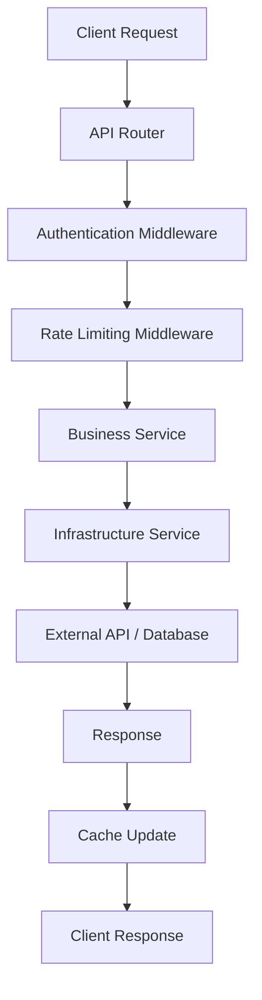

# TripSage Core Architecture

This document provides a comprehensive architectural overview of the `tripsage_core` package, the foundational layer of the TripSage AI travel planning platform.

## Table of Contents

- [Architectural Principles](#architectural-principles)
- [Layer Architecture](#layer-architecture)
- [Component Overview](#component-overview)
- [Data Flow Architecture](#data-flow-architecture)
- [Service Architecture](#service-architecture)
- [Integration Patterns](#integration-patterns)
- [Performance Architecture](#performance-architecture)
- [Security Architecture](#security-architecture)
- [Extensibility Patterns](#extensibility-patterns)

## Architectural Principles

### Clean Architecture Foundation

`tripsage_core` follows clean architecture principles with clear separation of concerns:

```
┌─────────────────────────────────────────┐
│              External Services          │
│    (Supabase, Google Maps, Weather)    │
└─────────────────────────────────────────┘
                    │
┌─────────────────────────────────────────┐
│         Infrastructure Services         │
│   (Database, Cache, WebSocket, Keys)   │
└─────────────────────────────────────────┘
                    │
┌─────────────────────────────────────────┐
│            Business Services            │
│  (Auth, Memory, Chat, Flight, Hotel)   │
└─────────────────────────────────────────┘
                    │
┌─────────────────────────────────────────┐
│               Core Models               │
│     (Domain, Database, Schemas)        │
└─────────────────────────────────────────┘
                    │
┌─────────────────────────────────────────┐
│          Foundation Layer               │
│    (Config, Exceptions, Utilities)     │
└─────────────────────────────────────────┘
```

### Design Principles

1. **Dependency Inversion** - Higher-level modules don't depend on lower-level modules
2. **Single Responsibility** - Each service has one clear purpose
3. **Open/Closed Principle** - Open for extension, closed for modification
4. **Interface Segregation** - Small, focused interfaces
5. **Dependency Injection** - Services receive dependencies rather than creating them

## Layer Architecture

### Foundation Layer

The lowest level providing core infrastructure:

#### Configuration Management (`config/`)
```python
class BaseAppSettings(BaseSettings):
    """Centralized configuration with environment-specific overrides"""
    
    # Environment
    environment: Environment = Environment.DEVELOPMENT
    debug: bool = False
    
    # Core Services
    supabase_url: str
    supabase_key: str
    dragonfly_url: str
    
    # Feature Flags
    enable_caching: bool = True
    enable_telemetry: bool = True
```

**Responsibilities:**
- Environment-specific configuration loading
- Validation of critical settings
- Feature flag management
- Integration credentials management

#### Exception System (`exceptions/`)
```python
# Hierarchical exception structure
CoreTripSageError
├── AuthenticationError      (401)
├── AuthorizationError       (403)
├── ValidationError          (422)
├── ExternalAPIError         (502)
├── DatabaseError            (500)
└── RateLimitError          (429)
```

**Features:**
- Automatic HTTP status code mapping
- Consumer-aware error formatting
- Structured error details with Pydantic
- Backward compatibility with legacy exceptions

#### Utilities (`utils/`)
Cross-cutting concerns and helper functions:
- **Cache utilities** - TTL management and key generation
- **Error handling** - Retry logic and recovery patterns
- **Logging** - Structured logging with OpenTelemetry
- **Database** - Connection management and transactions
- **Security** - Encryption and validation helpers

### Model Layer

Data structures and validation logic:

#### Base Models (`models/base_core_model.py`)
```python
class TripSageModel(BaseModel):
    """Base for API/Schema models with validation"""
    model_config = ConfigDict(
        str_strip_whitespace=True,
        validate_assignment=True,
        arbitrary_types_allowed=True
    )

class TripSageDomainModel(TripSageModel):
    """Base for business domain entities"""
    
class TripSageDBModel(TripSageModel):
    """Base for database models with SQLAlchemy integration"""
```

#### Model Categories

1. **Database Models (`db/`)** - SQLAlchemy-compatible models
   - User management (`user.py`)
   - Trip planning (`trip.py`, `itinerary_item.py`)
   - Travel data (`flight.py`, `accommodation.py`)
   - Chat and memory (`chat.py`, `memory.py`)
   - API management (`api_key.py`)

2. **Domain Models (`domain/`)** - Business entities
   - Rich business logic
   - Validation rules
   - Business invariants

3. **Schema Models (`schemas_common/`)** - Shared data structures
   - Common enums and types
   - Validation patterns
   - API request/response schemas

### Service Layer

Three-tier service architecture:

## Service Architecture

### Business Services Tier

Core business logic with clean interfaces:

```python
# Service interface pattern
class BaseService:
    def __init__(self, settings: BaseAppSettings):
        self.settings = settings
        self.db = DatabaseService(settings)
        self.cache = CacheService(settings)
```

#### Service Registry Pattern
```python
class ServiceRegistry:
    """Centralized service management with dependency injection"""
    
    def __init__(self, settings: BaseAppSettings):
        self.settings = settings
        self._services = {}
    
    def get_service(self, service_type: Type[T]) -> T:
        """Get or create service instance"""
        if service_type not in self._services:
            self._services[service_type] = service_type(self.settings)
        return self._services[service_type]
```

#### Key Business Services

**AuthService** - Authentication and authorization
```python
class AuthService:
    async def authenticate_token(self, token: str) -> UserSession
    async def authorize_action(self, user: User, action: str) -> bool
    async def refresh_token(self, refresh_token: str) -> TokenPair
```

**MemoryService** - Context and conversation memory
```python
class MemoryService:
    async def store_memory(self, user_id: str, content: str) -> Memory
    async def search_memories(self, query: str, limit: int) -> List[Memory]
    async def get_conversation_context(self, session_id: str) -> Context
```

**FlightService** - Flight operations
```python
class FlightService:
    async def search_flights(self, criteria: FlightSearchCriteria) -> FlightResults
    async def get_flight_details(self, flight_id: str) -> FlightDetail
    async def track_price_changes(self, flight_id: str) -> PriceHistory
```

### External API Services Tier

Standardized third-party integrations:

```python
class ExternalAPIService:
    """Base class for external API integrations"""
    
    def __init__(self, settings: BaseAppSettings):
        self.settings = settings
        self.client = self._create_client()
        self.rate_limiter = RateLimiter(self.get_rate_limits())
    
    async def _make_request(self, method: str, endpoint: str, **kwargs):
        """Standardized request handling with retry and error handling"""
```

#### Key External Services

**GoogleMapsService** - Location and mapping
- Geocoding and reverse geocoding
- Place search and details
- Route planning and optimization
- Geographic data enrichment

**WeatherService** - Weather data and forecasting
- Current conditions and forecasts
- Historical weather data
- Weather-based travel recommendations
- Climate information for destinations

**CalendarService** - Calendar integration
- Event scheduling and management
- Availability checking
- Travel itinerary synchronization
- Meeting coordination for business travel

### Infrastructure Services Tier

Core infrastructure management:

#### DatabaseService
```python
class DatabaseService:
    """Database operations with transaction management"""
    
    async def __aenter__(self):
        self.connection = await self.pool.acquire()
        self.transaction = self.connection.transaction()
        await self.transaction.start()
        return self
    
    async def __aexit__(self, exc_type, exc_val, exc_tb):
        if exc_type:
            await self.transaction.rollback()
        else:
            await self.transaction.commit()
        await self.pool.release(self.connection)
```

#### CacheService
```python
class CacheService:
    """High-performance caching with DragonflyDB"""
    
    # Multi-tier TTL strategy
    TTL_SHORT = 300      # 5 minutes - real-time data
    TTL_MEDIUM = 3600    # 1 hour - moderate volatility
    TTL_LONG = 86400     # 24 hours - stable data
    
    async def get_or_set(self, key: str, factory: Callable, ttl: int):
        """Cache-aside pattern implementation"""
```

#### WebSocketManager
```python
class WebSocketManager:
    """Real-time communication management"""
    
    async def connect(self, websocket: WebSocket, user_id: str)
    async def disconnect(self, websocket: WebSocket)
    async def broadcast_to_user(self, user_id: str, message: dict)
    async def broadcast_to_room(self, room_id: str, message: dict)
```

## Data Flow Architecture

### Request Processing Flow



### Service Interaction Pattern

```python
# Example: Flight search flow
async def search_flights(self, criteria: FlightSearchCriteria) -> FlightResults:
    # 1. Validate input
    validated_criteria = self._validate_criteria(criteria)
    
    # 2. Check cache
    cache_key = self._generate_cache_key(validated_criteria)
    cached_results = await self.cache.get(cache_key)
    if cached_results:
        return cached_results
    
    # 3. Call external service
    results = await self.external_api.search_flights(validated_criteria)
    
    # 4. Process and enrich data
    enriched_results = await self._enrich_flight_data(results)
    
    # 5. Store in cache
    await self.cache.set(cache_key, enriched_results, ttl=self.TTL_MEDIUM)
    
    # 6. Store in database for analytics
    await self.db.store_search_results(criteria, enriched_results)
    
    return enriched_results
```

### Memory and Context Flow

```python
# Conversation context management
async def process_chat_message(self, message: ChatMessage) -> ChatResponse:
    # 1. Retrieve conversation context
    context = await self.memory_service.get_conversation_context(
        message.session_id
    )
    
    # 2. Search relevant memories
    relevant_memories = await self.memory_service.search_memories(
        query=message.content,
        user_id=message.user_id,
        limit=10
    )
    
    # 3. Process with agent
    response = await self.agent_service.process_message(
        message=message,
        context=context,
        memories=relevant_memories
    )
    
    # 4. Store new memories
    await self.memory_service.store_memory(
        user_id=message.user_id,
        content=message.content,
        response=response.content,
        session_id=message.session_id
    )
    
    return response
```

## Integration Patterns

### Database Integration Pattern

```python
# Repository pattern with async context managers
class TripRepository:
    def __init__(self, db_service: DatabaseService):
        self.db = db_service
    
    async def create_trip(self, trip_data: TripCreate) -> Trip:
        async with self.db as db:
            trip = Trip(**trip_data.model_dump())
            return await db.create(trip)
    
    async def get_user_trips(self, user_id: str) -> List[Trip]:
        async with self.db as db:
            return await db.query(Trip).filter(
                Trip.user_id == user_id
            ).all()
```

### Cache Integration Pattern

```python
# Decorator-based caching
@cache_result(ttl=CacheService.TTL_MEDIUM)
async def get_destination_info(self, destination: str) -> DestinationInfo:
    # Expensive operation - cached automatically
    return await self.external_api.get_destination_details(destination)

# Manual cache management for complex scenarios
async def search_accommodations(self, criteria: SearchCriteria) -> AccommodationResults:
    cache_key = cache_utils.generate_key("accommodations", **criteria.dict())
    
    # Try cache first
    cached = await self.cache.get(cache_key)
    if cached and not criteria.force_refresh:
        return cached
    
    # Fetch from external API
    results = await self.accommodation_api.search(criteria)
    
    # Cache with appropriate TTL based on search parameters
    ttl = self._calculate_cache_ttl(criteria)
    await self.cache.set(cache_key, results, ttl=ttl)
    
    return results
```

### Error Handling Pattern

```python
# Layered error handling with context
class ServiceErrorHandler:
    @staticmethod
    async def handle_external_api_error(
        error: Exception,
        service_name: str,
        operation: str
    ) -> None:
        if isinstance(error, httpx.TimeoutException):
            raise ExternalAPIError(
                f"{service_name} timeout during {operation}",
                details={"service": service_name, "operation": operation}
            )
        elif isinstance(error, httpx.HTTPStatusError):
            if error.response.status_code == 429:
                raise RateLimitError(f"{service_name} rate limit exceeded")
            else:
                raise ExternalAPIError(
                    f"{service_name} API error: {error.response.status_code}",
                    details={"status_code": error.response.status_code}
                )
        else:
            raise ExternalAPIError(f"Unexpected error in {service_name}: {error}")
```

## Performance Architecture

### Caching Strategy

```python
# Multi-tier caching with intelligent TTL
class CacheStrategy:
    REAL_TIME_DATA = 300      # 5 min - prices, availability
    MODERATE_DATA = 3600      # 1 hour - search results, weather
    STABLE_DATA = 86400       # 24 hours - destination info, static data
    PERSISTENT_DATA = 604800  # 7 days - user preferences, historical data
    
    @classmethod
    def get_ttl_for_data_type(cls, data_type: str) -> int:
        ttl_map = {
            "flight_prices": cls.REAL_TIME_DATA,
            "search_results": cls.MODERATE_DATA,
            "destination_info": cls.STABLE_DATA,
            "user_preferences": cls.PERSISTENT_DATA
        }
        return ttl_map.get(data_type, cls.MODERATE_DATA)
```

### Database Performance

```python
# Connection pooling and query optimization
class DatabaseConfig:
    # Connection pool settings
    POOL_SIZE = 20
    MAX_OVERFLOW = 30
    POOL_TIMEOUT = 30
    POOL_RECYCLE = 3600
    
    # Query optimization
    ENABLE_QUERY_CACHE = True
    SLOW_QUERY_THRESHOLD = 1.0  # seconds
    
    # Index optimization hints
    SEARCH_INDEXES = [
        "idx_trips_user_id_created_at",
        "idx_flights_route_date",
        "idx_accommodations_location_checkin"
    ]
```

### Memory Management

```python
# Vector similarity search optimization
class MemoryOptimization:
    # Mem0 configuration for optimal performance
    VECTOR_DIMENSIONS = 1536  # OpenAI ada-002 dimensions
    SIMILARITY_THRESHOLD = 0.7
    MAX_MEMORY_CONTEXT = 50  # Maximum memories per context
    MEMORY_COMPRESSION_RATIO = 0.8  # Compress old memories
    
    async def optimize_memory_retrieval(
        self,
        query: str,
        user_id: str,
        limit: int = 10
    ) -> List[Memory]:
        # Use pgvector for efficient similarity search
        return await self.vector_search(
            query_vector=await self.embed_query(query),
            user_id=user_id,
            threshold=self.SIMILARITY_THRESHOLD,
            limit=limit
        )
```

## Security Architecture

### Authentication & Authorization

```python
# Multi-layer security model
class SecurityModel:
    # Authentication methods
    JWT_TOKENS = "primary"      # For user sessions
    API_KEYS = "service"        # For service-to-service
    BYOK = "user_provided"      # For user's external API keys
    
    # Authorization levels
    USER = "user"               # Basic user operations
    ADMIN = "admin"             # Administrative functions
    SERVICE = "service"         # Service-to-service operations
    
    async def authenticate_request(self, request: Request) -> AuthContext:
        # JWT token authentication
        if "Authorization" in request.headers:
            return await self.verify_jwt_token(request.headers["Authorization"])
        
        # API key authentication
        elif "X-API-Key" in request.headers:
            return await self.verify_api_key(request.headers["X-API-Key"])
        
        else:
            raise AuthenticationError("No valid authentication provided")
```

### Data Protection

```python
# Encryption and data security
class DataSecurity:
    # Encryption for sensitive data
    @staticmethod
    def encrypt_api_key(api_key: str, user_salt: str) -> str:
        """Encrypt user-provided API keys"""
        return fernet.encrypt(f"{api_key}:{user_salt}".encode()).decode()
    
    @staticmethod
    def decrypt_api_key(encrypted_key: str, user_salt: str) -> str:
        """Decrypt user-provided API keys"""
        decrypted = fernet.decrypt(encrypted_key.encode()).decode()
        api_key, salt = decrypted.split(":", 1)
        if salt != user_salt:
            raise SecurityError("Invalid decryption salt")
        return api_key
    
    # Input validation
    @staticmethod
    def validate_user_input(data: dict) -> dict:
        """Sanitize and validate user input"""
        # XSS prevention, SQL injection protection, etc.
        return sanitized_data
```

### Rate Limiting

```python
# Advanced rate limiting with principal-based controls
class RateLimitingStrategy:
    # Standard limits
    USER_REQUESTS_PER_MINUTE = 100
    USER_REQUESTS_PER_HOUR = 1000
    
    # Enhanced limits for authenticated users
    AUTHENTICATED_USER_MULTIPLIER = 5
    
    # Service-to-service limits
    SERVICE_REQUESTS_PER_MINUTE = 1000
    
    async def check_rate_limit(
        self,
        principal_id: str,
        principal_type: str,
        endpoint: str
    ) -> bool:
        key = f"rate_limit:{principal_type}:{principal_id}:{endpoint}"
        current_count = await self.cache.get(key) or 0
        
        limit = self._get_limit_for_principal(principal_type, endpoint)
        
        if current_count >= limit:
            raise RateLimitError(f"Rate limit exceeded for {principal_type}")
        
        await self.cache.incr(key, ttl=60)  # 1 minute window
        return True
```

## Extensibility Patterns

### Plugin Architecture

```python
# Service plugin system
class ServicePlugin:
    """Base class for service extensions"""
    
    def __init__(self, settings: BaseAppSettings):
        self.settings = settings
    
    async def initialize(self) -> None:
        """Initialize plugin resources"""
        pass
    
    async def cleanup(self) -> None:
        """Cleanup plugin resources"""
        pass

class PluginManager:
    def __init__(self):
        self.plugins: Dict[str, ServicePlugin] = {}
    
    def register_plugin(self, name: str, plugin: ServicePlugin):
        """Register a new service plugin"""
        self.plugins[name] = plugin
    
    async def initialize_plugins(self):
        """Initialize all registered plugins"""
        for plugin in self.plugins.values():
            await plugin.initialize()
```

### Event System

```python
# Event-driven architecture for loose coupling
class EventBus:
    def __init__(self):
        self.handlers: Dict[str, List[Callable]] = {}
    
    def subscribe(self, event_type: str, handler: Callable):
        """Subscribe to events"""
        if event_type not in self.handlers:
            self.handlers[event_type] = []
        self.handlers[event_type].append(handler)
    
    async def publish(self, event_type: str, data: dict):
        """Publish events to subscribers"""
        if event_type in self.handlers:
            for handler in self.handlers[event_type]:
                await handler(data)

# Usage example
event_bus = EventBus()

@event_bus.subscribe("trip.created")
async def on_trip_created(data: dict):
    # Send welcome email, initialize recommendations, etc.
    await email_service.send_welcome_email(data["user_id"])
    await recommendation_service.initialize_user_preferences(data["user_id"])
```

### Configuration Extensions

```python
# Dynamic configuration system
class ConfigurationExtension:
    """Allows services to extend base configuration"""
    
    @classmethod
    def extend_settings(cls, base_settings: BaseAppSettings) -> BaseAppSettings:
        """Extend base settings with service-specific configuration"""
        return base_settings
    
class FlightServiceConfig(ConfigurationExtension):
    duffel_api_key: str
    default_search_radius: int = 50
    max_flight_results: int = 100
    
    @classmethod
    def extend_settings(cls, base_settings: BaseAppSettings) -> BaseAppSettings:
        # Add flight-specific settings
        base_settings.flight_config = cls()
        return base_settings
```

This architecture provides a solid foundation for the TripSage platform with clear separation of concerns, robust error handling, high performance, and strong security while maintaining extensibility for future enhancements.